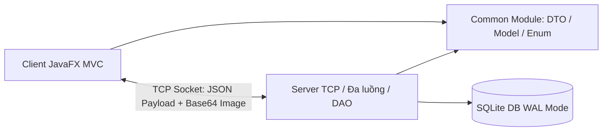
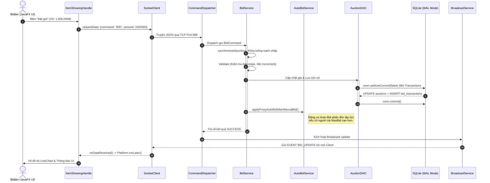
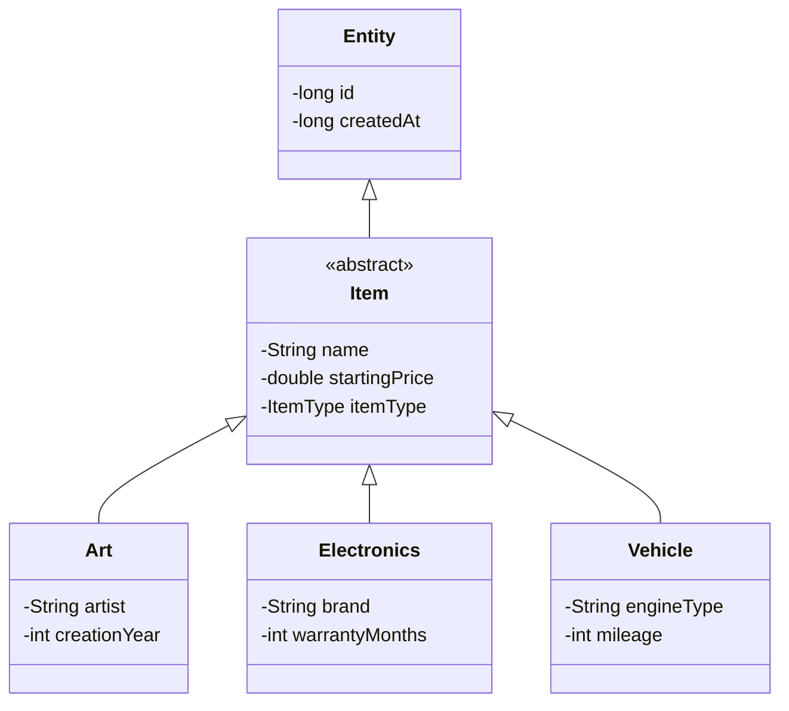
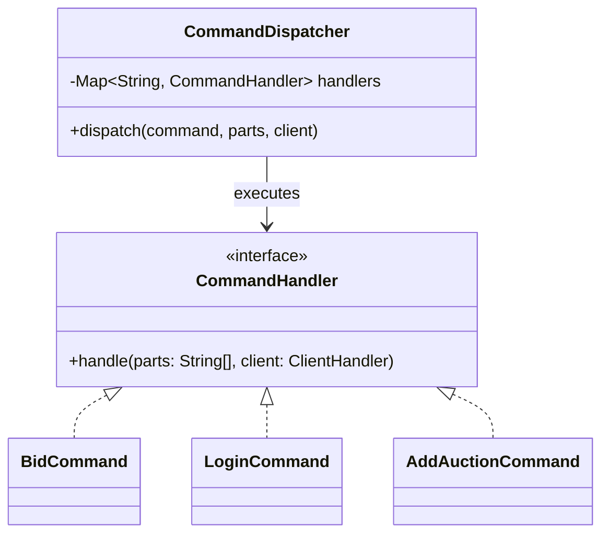

# Kiến Trúc Hệ Thống & Bản Đồ Lớp MiniBoom (Architecture & Class Diagram)

Tài liệu này mô tả cấu trúc class/module chính và kiến trúc nghiệp vụ cốt lõi (Bidding Pipeline) của hệ thống đấu giá trực tuyến MiniBoom. Kiến trúc được thiết kế theo chuẩn Clean Architecture, tập trung xử lý an toàn đồng thời (concurrency) và truyền tải sự kiện thời gian thực (real-time).

## 1. Sơ Đồ Phân Rã Module (Module Map)

Hệ thống được chia thành 3 module Maven độc lập nhằm cách ly tuyệt đối giao diện người dùng khỏi các logic truy xuất cơ sở dữ liệu.



## 2. Bản Đồ Gói (Package Map)

### 2.1. Server Packages
Tầng Server là trái tim của hệ thống, nơi xử lý mọi logic nghiệp vụ hạng nặng, được phân lớp rạch ròi:

```text
com.bidding.server/
├── ServerApplication.java        (Điểm mốc khởi chạy máy chủ)
├── database/                     (Quản lý kết nối & Schema)
│   ├── DatabaseManager.java      (Singleton cấp phát Connection cấu hình WAL)
│   └── DatabaseInitializer.java  (Auto-provision tạo bảng & dữ liệu mẫu)
├── network/                      (Tầng giao tiếp mạng)
│   ├── AuctionServer.java        (Lắng nghe Port 888, quản lý ThreadPool)
│   ├── ClientHandler.java        (Runnable xử lý từng luồng TCP riêng biệt)
│   ├── command/
│   │   ├── CommandDispatcher.java(Bộ định tuyến gói tin JSON)
│   │   ├── CommandHandler.java   (Interface cho các lệnh)
│   │   └── [Các lớp Command cụ thể như BidCommand, LoginCommand...]
│   └── service/
│       └── BroadcastService.java (Phân phối sự kiện Real-time tới Client)
├── core/                         (Tầng Nghiệp Vụ - Business Logic)
│   ├── AuctionService.java       (Facade chính điều phối vòng đời)
│   ├── BidService.java           (Logic đặt giá thủ công)
│   ├── AutoBidService.java       (Động cơ tự động trả giá - Proxy Bidding)
│   ├── PaymentService.java       (Thanh toán hậu kiểm nguyên tử)
│   └── TransactionService.java   (Chuyển tiền giữa các User)
└── repository/                   (Tầng Truy xuất Dữ liệu - DAO Layer)
    ├── BaseDAO.java              (Lớp cơ sở cung cấp kết nối)
    ├── AuctionDAO.java           (Chứa Transaction Atomic đặt giá)
    └── [UserDAO, ItemDAO, BidHistoryDAO...]
```

### 2.2. Client Packages
Tầng Client thuần túy là giao diện hiển thị, nhận tín hiệu bất đồng bộ và vẽ đồ thị UI.

```text
action/
├── Core/                         (SceneSwitch điều phối màn hình)
├── controller/                   (Tầng Controller điều khiển UI JavaFX)
│   ├── admin/                    (Quản lý hệ thống: duyệt ví, duyệt phiên)
│   ├── auth/                     (Đăng nhập, đăng ký, quên mật khẩu)
│   ├── payment/                  (Xử lý giao diện thanh toán)
│   └── SellingJobs/              (Phòng đấu giá: ItemShowingHandle...)
├── model/                        (Data Binding cục bộ)
└── network/                      (Xử lý I/O Mạng)
    ├── SocketClient.java         (Singleton TCP Client)
    ├── CentralReceiver.java      (Background Thread lắng nghe Server)
    └── SocketListener.java       (Interface Observer cập nhật UI)
```

## 3. Tại Sao Bidding Có Pipeline Riêng?

Khác với các Service mang tính chất CRUD thông thường (tạo user, tạo sản phẩm), **Bidding (Đặt giá)** và **Payment (Thanh toán)** là nghiệp vụ có rất nhiều side-effect (tác dụng phụ) chéo nhau:
- Một lệnh đặt giá thủ công (`Manual Bid`) có thể kích hoạt động cơ phản đòn của người dùng khác (`Auto-Bid`).
- Việc đặt giá sát giờ có thể kích hoạt tính năng **Anti-Snipe**, buộc hệ thống thay đổi `ending_time` của phiên.
- Thanh toán hậu kiểm (`Post-Checkout`) yêu cầu vừa trừ tiền người mua, vừa cộng tiền người bán và sinh log trong cùng 1 truy vấn.

Vì vậy, `AuctionService` đóng vai trò là một **Facade Pattern**, rẽ nhánh luồng dữ liệu sang các Service độc lập (`BidService`, `AutoBidService`, `PaymentService`) trước khi đưa xuống Database thực thi **Transaction Atomic** (`conn.setAutoCommit(false)`).

## 4. Luồng Xử Lý Đặt Giá (Bid Flow Sequence)

Sơ đồ dưới đây mô tả cách hệ thống xử lý một lệnh đặt giá đảm bảo an toàn đồng thời (Concurrency Safe).



## 5. Đa Hình Trong Hệ Thống (Polymorphism)

Hệ thống ứng dụng triệt để tính đa hình (Polymorphism) và kế thừa (Inheritance) để tuân thủ nguyên lý Đóng-Mở (OCP - Open-Closed Principle).

### 5.1. Đa hình Dữ liệu (Domain Polymorphism)
Lớp `Item` là một lớp trừu tượng. Tầng `ItemDAO` sử dụng luồng `switch-case` thông minh để ánh xạ (Map) dữ liệu từ SQLite lên đúng Java Object.



### 5.2. Đa hình Bộ Định Tuyến (Command Pattern)
Để loại bỏ các khối lệnh `if-else` khổng lồ khi nhận thông điệp mạng, máy chủ điều phối qua `CommandDispatcher`. Khi cần thêm tính năng mới (Ví dụ: Đổi mật khẩu), chỉ cần tạo class `ChangePasswordCommand implements CommandHandler`.

