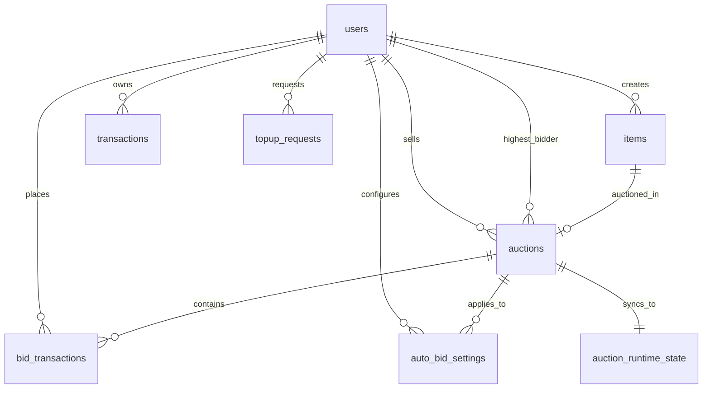

# Thiết Kế Cơ Sở Dữ Liệu SQLite MiniBoom

Cơ sở dữ liệu của MiniBoom được thiết kế theo chuẩn Zero-Config, tự động khởi tạo (Auto-provision) qua lớp `DatabaseInitializer.java`. Khác với các hệ thống client-server thông thường phải dùng MySQL/PostgreSQL, MiniBoom sử dụng **SQLite kích hoạt WAL Mode** (Write-Ahead Logging) để xử lý tranh chấp đa luồng cực kỳ hiệu quả, loại bỏ triệt để lỗi *Database Locked*.

## 1. Sơ Đồ Thực Thể Liên Kết (ERD)

## 2. Chi Tiết Các Bảng Chính

### `users`
Lưu trữ thông tin định danh, vai trò phân quyền và số dư ví điện tử của người dùng.

| Cột | Kiểu Dữ Liệu | Ý nghĩa |
| :--- | :--- | :--- |
| `id` | INTEGER | Khóa chính, tự tăng |
| `username` | TEXT | Tên đăng nhập (UNIQUE) |
| `password_hash` | TEXT | Mật khẩu đã băm bằng chuẩn bảo mật PBKDF2 |
| `email`, `phone` | TEXT | Thông tin liên hệ, cá nhân |
| `role` | TEXT | Vai trò: `ADMIN`, `SELLER`, `USER/BIDDER` |
| `balance` | REAL | Số dư khả dụng trong ví điện tử |
| `created_at` | BIGINT | Thời điểm tạo tài khoản (Lưu bằng mili giây chuẩn xác) |

### `items`
Lưu trữ thông tin sản phẩm. Bảng này áp dụng mẫu thiết kế **STI (Single Table Inheritance)** để lưu trữ đa dạng chủng loại tài sản trên cùng một bảng, tối ưu hóa việc truy vấn.

| Cột | Kiểu Dữ Liệu | Ý nghĩa |
| :--- | :--- | :--- |
| `id` | INTEGER | Khóa chính, tự tăng |
| `name`, `description` | TEXT | Tên và mô tả sản phẩm |
| `starting_price` | REAL | Mức giá sàn mong muốn ban đầu |
| `item_type` | TEXT | Phân loại danh mục: `ART`, `ELECTRONICS`, `VEHICLE` |
| `seller_username` | TEXT | FK trỏ tới `users.username` đăng bán |
| `image_url` | TEXT | Chuỗi Base64 hoặc tên file ảnh tải lên |
| `information1`, `information2` | TEXT | Trường động lưu dữ liệu linh hoạt theo ItemType |
| `artist`, `brand`, `mileage`... | TEXT/INT | Các trường rẽ nhánh riêng theo từng chủng loại tài sản |

### `auctions`
Bảng trung tâm kiểm soát vòng đời và trạng thái của phiên đấu giá.

| Cột | Kiểu Dữ Liệu | Ý nghĩa |
| :--- | :--- | :--- |
| `id` | INTEGER | Khóa chính phiên đấu giá |
| `item_id` | INTEGER | FK trỏ tới `items.id` |
| `seller_username` | TEXT | FK định danh người bán |
| `start_time`, `end_time` | BIGINT | Mốc thời gian mở/đóng phiên (mili giây) |
| `duration_minutes` | INTEGER | Thời lượng đếm ngược của phiên |
| `status` | TEXT | `PENDING`, `OPEN`, `RUNNING`, `FINISHED`, `CANCELED`, `PAID` |
| `current_highest_bid` | REAL | Mức giá cao nhất hiện tại |
| `highest_bidder_username` | TEXT | FK trỏ tới user đang dẫn đầu |

### `bid_transactions`
Lưu vết toàn bộ lịch sử trả giá, phục vụ việc vẽ biểu đồ LineChart Realtime ở Client.

| Cột | Kiểu Dữ Liệu | Ý nghĩa |
| :--- | :--- | :--- |
| `id` | INTEGER | Khóa chính |
| `auction_id` | INTEGER | FK trỏ tới `auctions.id` |
| `bidder_username` | TEXT | FK trỏ tới `users.username` đặt lệnh |
| `bid_amount` | REAL | Số tiền đặt cược |
| `bid_time` | BIGINT | Thời gian đặt cược chuẩn mili giây |

### `auto_bid_settings`
Lưu trữ hợp đồng ủy quyền cấu hình Đấu thầu tự động (Proxy Bidding) của Bidder.

| Cột | Kiểu Dữ Liệu | Ý nghĩa |
| :--- | :--- | :--- |
| `id` | INTEGER | Khóa chính |
| `auction_id` | INTEGER | Lệnh auto-bid áp dụng cho phiên đấu giá nào |
| `bidder_username` | TEXT | Người ủy quyền (chủ cấu hình) |
| `max_bid` | REAL | Mức giá trần tối đa chấp nhận trả |
| `increment` | REAL | Bước giá tăng thêm tối thiểu để vượt đối thủ |
| `is_active` | INTEGER | Trạng thái Bật/Tắt (1 hoặc 0) |

### `transactions` & `topup_requests`
Hệ thống lõi quản lý dòng tiền (Ví điện tử).

* **`topup_requests`:** Lưu các yêu cầu nạp tiền với trạng thái (`PENDING`, `APPROVED`, `REJECTED`), chờ Admin phê duyệt. Khi duyệt thành công, tiền mới được cộng vào bảng `users`.
* **`transactions`:** Sổ cái (Ledger) lưu mọi biến động số dư. Bất kỳ thao tác thanh toán (`checkout`) trừ tiền người mua hay cộng tiền người bán đều phải sinh bản ghi log đối soát tại đây.

### `auction_runtime_state`
Bảng tối ưu hóa hiệu năng, thiết kế riêng cho tiến trình `Auction Monitor Scheduler`. Giúp bộ lập lịch lấy snapshot toàn bộ các phiên đang chạy siêu tốc định kỳ mỗi 1 giây để kiểm tra đóng/mở phiên mà không cần JOIN dữ liệu phức tạp.

## 3. Transaction Và Concurrency

Vì MiniBoom là hệ thống đấu giá Realtime, rủi ro Race Condition (ghi đè dữ liệu) là cực kỳ lớn. CSDL xử lý vấn đề này thông qua các lớp bảo vệ khắt khe:
- **Application Level Lock:** Tầng Service khóa luồng bằng `synchronized(auction)`.
- **Atomic Transaction:** Thao tác đặt giá `placeBid()` (cập nhật giá lớn nhất + ghi lịch sử thầu) và `checkout()` (trừ ví A + cộng ví B + ghi log transactions) được bọc cứng trong khối `conn.setAutoCommit(false)`. Nếu xảy ra lỗi hoặc số dư không đủ, hệ thống gọi `conn.rollback()`, đảm bảo tính toàn vẹn dữ liệu (ACID) tuyệt đối.

## 4. Tối Ưu Hóa Truy Vấn (Database Indexing)

Để đảm bảo hiệu năng khi hệ thống sinh ra hàng triệu bản ghi, `DatabaseInitializer` đã tự động đánh các Index quan trọng:
- `idx_bid_auction_id`: Tăng tốc rút trích lịch sử thầu cho biểu đồ động của Client.
- `idx_auto_bid_auction_id` & `idx_auto_bid_active`: Truy vấn siêu tốc các cấu hình Auto-bid đang bật để Server phản đòn thời gian thực.
- `idx_topup_status`: Lọc nhanh danh sách nạp tiền chờ duyệt cho màn hình Admin.
- `idx_transactions_username_time`: Tối ưu hiển thị sổ cái giao dịch theo trình tự thời gian cho ví người dùng.